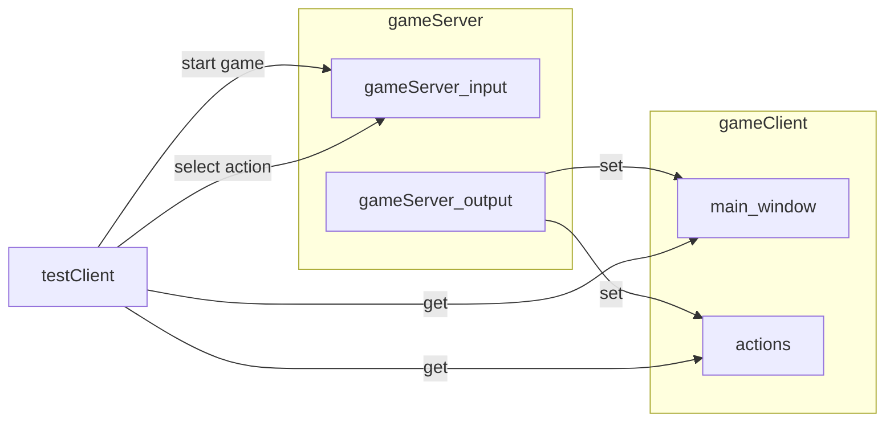

# qsp-test-engine

```mermaid
graph LR
  subgraph gameClient
    main_window
    actions
  end

  subgraph gameServer
    gameServer_input
    gameServer_output --> |set| actions
    gameServer_output --> |set| main_window
  end

  testClient --> |start game| gameServer_input
  testClient --> |select action| gameServer_input

  testClient --> |get| main_window

  testClient --> |get| actions
```
